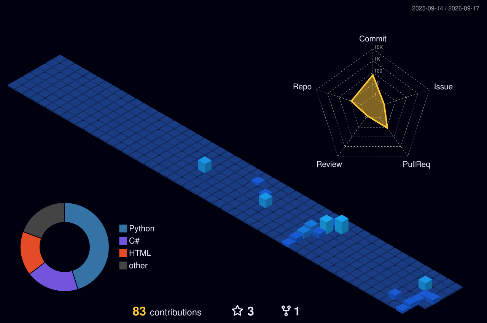

  

---

### 👾 Sobre Mim
- 🎓 Estudante de Ciência da Computação no **CEUB**
- 💻 Focado em desenvolvimento **Backend**
- 💬 Qualquer dúvida, basta perguntar!
- 📫 Como me encontrar: 

---

**Linguagens & Banco de Dados:**  

**Frontend:**  

---

  <h3>🐍 Contribuições Arcade</h3>
  <picture>
    <source media="(prefers-color-scheme: dark)" srcset="https://raw.githubusercontent.com/Henrique897777/Henrique897777/output/github-contribution-grid-snake-dark.svg">
    <source media="(prefers-color-scheme: light)" srcset="https://raw.githubusercontent.com/Henrique897777/Henrique897777/output/github-contribution-grid-snake.svg">
    
  </picture>

    

  <h3>🏙️ Contribuições em 3D</h3>
  

